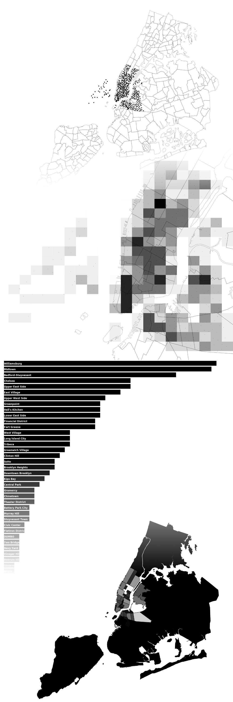

# geospatial-storytelling

This project is about visualizing personal GPS data with Python. The goal was to explore the different ways of visualizing the GPS data which I have collected during my stay in New York.

## Required packages

- [numpy](http://www.numpy.org/) fundamental package for scientific computing with Python
- [matplotlib](http://matplotlib.org/) python 2D plotting library
- [gdal](https://pypi.python.org/pypi/GDAL) python bindings for Geospatial Data Abstraction Library (and OGR)
- [Basemap](https://github.com/matplotlib/basemap) plot on map projections using matplotlib

This project was implemented on Windows and the GDAL binaries are installed through the help of the following link: [Installing GDAL for Windows](http://sandbox.idre.ucla.edu/sandbox/tutorials/installing-gdal-for-windows).

## Source files

All the source files in the [src](src) folder produce images which are saved in the [visualization](visualization) folder.

- [simple_scatter.py](src/simple_scatter.py) 
	Scatter plot visualization of the data set on top of the neighborhoods.
- [point_heatmap.py](src/point_heatmap.py)
	Previous visualization with added heatmap layer.
- [compute_neighborhood_histogram.py](src/compute_neighborhood_histogram.py)
	This source file is necessary to compute the number of points for each neighborhood and visualize a bar chart histogram.
- [neighborhood_heatmap.py](src/neighborhood_heatmap.py)
	Heatmap visualization with histogram bins for each neighborhood. [neighborhood_histogram.npy](src/neighborhood_histogram.npy) is necessary to run this visualization, which is computed by [compute_neighborhood_histogram.py](src/compute_neighborhood_histogram.py).

## Data sets

The example data set used for the visualizations is from the [Citibike System Data](https://www.citibikenyc.com/system-data), which can be found on the real-time [Citibike station feed](https://feeds.citibikenyc.com/stations/stations.json).

The NYC Neighborhood boundaries with the respective are used from the GeoJSON file of the [Pediacities NYC Neighborhoods](http://catalog.opendata.city/dataset/pediacities-nyc-neighborhoods).

